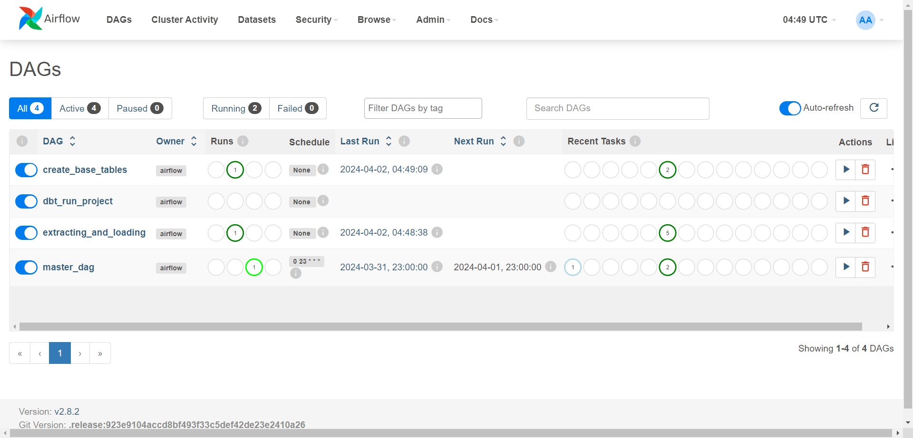

# Capital Bikeshare Data Engineering Project


## Table of Contents
1. [Overview](#overview)
2. [Technical Structure](#technical-structure)
3. [Prerequisites](#prerequisites)
4. [Deployment Guide](#deployment-guide)
   - [Local Environment Setup](#local-environment-setup)
   - [Cloud Deployment with Terraform](#cloud-deployment-with-terraform)
5. [Dashboard Visualization](#dashboard-visualization)


## Overview

This repository hosts a comprehensive data engineering project developed during the Data Engineering Zoomcamp. The project focuses on processing data from Capital Bikeshare, a public bike-sharing system in Washington, D.C., with extensive datasets available at [Capital Bikeshare’s System Data](https://capitalbikeshare.com/system-data). These datasets encapsulate information about bike rentals, including journey times, start and end locations, station details, and user types.

The goal of this project is to deploy pipelines designed to automate the extraction of data from the website, apply necessary transformations to clean and structure the data effectively, and finally, store it in a Google BigQuery data warehouse. The ultimate goal of this infrastructure is to facilitate the availability of processed data for various analytical purposes, including but not limited to, the creation of comprehensive dashboards. 

## Technical Structure

The project is architected to showcase a modern data engineering stack, comprising:

- **Apache Airflow**: Orchestrates the data pipeline, managing tasks from data extraction to loading into the data warehouse.
- **PostgreSQL**: Serves as the metadata database for Airflow, tracking job statuses and logs.
- **PgAdmin**: Provides a web-based interface for PostgreSQL database administration.
- **DBT (Data Build Tool)**: Used for transforming data within the data warehouse, applying business logic, and ensuring data quality.
- **Docker**: Containers encapsulate each component of the stack for ease of deployment and isolation.

Integration with GCP’s BigQuery and Cloud Storage demonstrates the project’s cloud-native approach, enabling scalable data storage and sophisticated analytics.

## Prerequisites

Before deploying the project, the following prerequisites are necessary:

- Docker and Docker Compose: For running the containerized environment.
- A GCP account: To access Google Cloud services such as BigQuery and Cloud Storage.
- Terraform: For automating the deployment of cloud resources.
- Familiarity with CLI operations: As the deployment and interaction with the project are largely conducted through the command line.

## Deployment Guide

### Local Environment Setup

Setting up the data engineering environment locally involves several key steps to ensure all components are correctly configured and deployed. Follow these steps to set up the project on your local machine:

1. **Clone the Repository**: Start by cloning this repository. Once cloned, navigate into the `services` directory which contains the Docker configuration files and service definitions.

    ```sh
    git clone <repository-url>
    cd <repository-name>/services
    ```

2. **Environment Variables**: Create a `.env` file in the `services` directory. Use the `example.env` file as a guide to understand which environment variables need to be set. Update the values according to your environment and GCP configuration.

    ```sh
    cp example.env .env
    # Then edit the .env file with your specific configurations
    ```

3. **GCP Service Account**: Place your GCP service account JSON file in the `keys` directory. If you prefer to use a different directory, make sure to update the path accordingly in the `.env` file. This file is crucial for enabling interactions with GCP services.

    ```sh
    mkdir -p keys
    # Copy your GCP service account JSON file to the keys directory
    cp path/to/your/service-account-file.json keys/
    ```

4. **Processor Architecture**: Before running `docker-compose`, you need to specify the processor architecture in the `dbt.Dockerfile`. You can find this setting on line 6 of the file. Adjust this line to match the architecture of your local system's CPU.

    ```dockerfile
    # Example adjustment for an AMD64 architecture
    # Top level build args
    ARG build_for=linux/amd64
    ```

    ```dockerfile
    # Example adjustment for an ARM architecture
    # Top level build args
    ARG build_for=linux/arm64
    ```

5. **Deploy Stack with Docker Compose**: With the initial configuration completed, deploy the stack using the following command:

    ```sh
    docker-compose up -d --build
    ```

6. **Monitor Deployment**: After executing the `docker-compose` command, use your favorite monitoring tool to verify that the stack has deployed correctly. For example, you can use Portainer's dashboard to monitor the services. 

    

    To install Portainer, follow the instructions at: [Portainer Installation Documentation](https://docs.portainer.io/start/install-ce/server/docker).

7. **Access Airflow**: Once the stack is running, open a web browser and navigate to `http://localhost:8080` to access the Airflow web interface. Here you should see the DAGs already running.

    

8. **Execute DAGs**: To populate the data warehouse, you can manually trigger the DAGs from the Airflow interface. If you need to process multiple DAGs, you can utilize the `reprocess_datalake.sh` script found in the `airflow_scheduler` container.

    ```sh
    # This command should be run from within the scheduler container
    ./reprocess_datalake.sh
    ```

9. **Troubleshooting DBT DAG**: If you encounter issues with the DAG that runs DBT tasks, you can execute DBT commands directly using the following `docker-compose` command:

    ```sh
    docker-compose run --rm dbt-bg run --project-dir /usr/app/dbt/capital_bikeshare
    ```

Remember to replace `<repository-url>` and `<repository-name>` with the actual URL and name of your repository, and adjust any file paths as per your project's structure.

### Cloud Deployment with Terraform

Deploying the project in a cloud environment requires a series of steps that involve creating secure access credentials and initializing Terraform configurations. Follow these steps to deploy the project on a cloud instance:

1. **Generate SSH Key**: Generate an SSH key pair to securely connect to the cloud instance. This key will be used to authenticate your connection without the need for passwords. Use the following command and ensure to use a email associated with the cloud account:

    ```sh
    ssh-keygen -t rsa -b 2048 -C "your-email@example.com"
    # Follow the prompts to specify the file in which to save the key
    ```

2. **Terraform Configuration**: Create a `terraform.tfvars` file by copying the provided example. This file will contain your cloud environment's specific configuration values, such as the project ID, region, and credentials.

    ```sh
    cp terraform.tfvars_example terraform.tfvars
    # Edit the terraform.tfvars file with your cloud configurations
    ```

3. **Deploy Environment**: With the Terraform variables set, apply your Terraform plan to deploy your cloud resources. This step will create the necessary infrastructure for your data engineering stack, including compute instances, storage, and networking components.

    ```sh
    terraform init
    terraform apply
    # Confirm the action when prompted by Terraform
    ```

4. **SSH Connection**: After your environment is deployed, connect to your cloud instance via SSH to finalize the setup. Use the IP address or hostname provided by your cloud provider along with the path to your private SSH key.

    ```sh
    ssh -i path/to/your/private-key user@host
    # Make sure to replace path/to/your/private-key and user@host with your actual key path and instance details
    ```

5. **Docker Stack Deployment**: Once connected to the instance, follow the same steps detailed in the [Local Environment](#local-environment) setup to deploy the Docker stack.

## Dashboard Visualization

The culmination of the data pipeline is a dynamic dashboard providing intuitive visualizations of the bikeshare data. Here’s an overview of what the dashboard presents:

- **Rides per Date**: A time series chart that displays the number of rides per day, allowing users to identify trends and patterns over time.
- **Member Type per Day**: A bar chart comparing the daily usage between members and casual riders, which can be instrumental in tailoring marketing strategies.
- **Rides per Time of Day**: A pie chart breaking down rides by different times of the day, offering insights into peak usage hours.
- **Rides per Length Category**: Another pie chart showing the distribution of ride lengths, useful for understanding customer behavior.

These visualizations serve to transform the raw data into actionable insights, providing a clear narrative of usage patterns, member engagement, and operational metrics. The dashboard is built to be interactive, allowing users to filter data based on date ranges and station IDs, making it a powerful tool for stakeholders to make data-driven decisions.


For a deeper dive into the insights each visualization offers, or to explore the live dashboard, please refer to [this link](https://lookerstudio.google.com/reporting/59857631-5d96-4d41-9d09-152843bbc71a).
